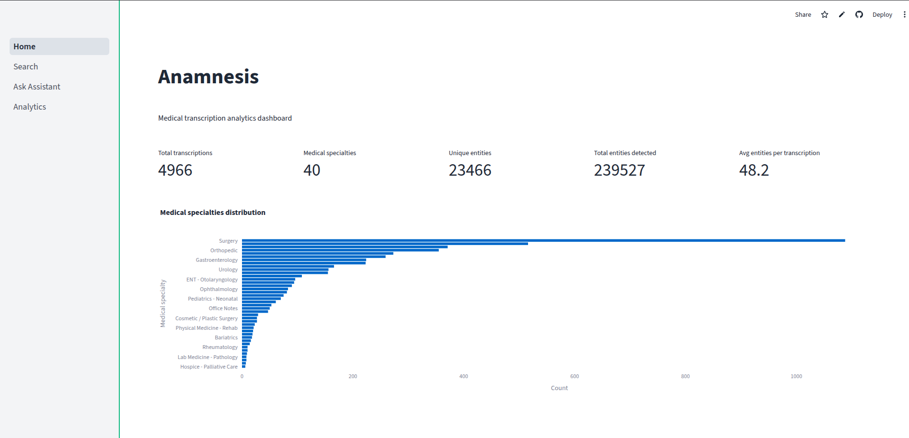
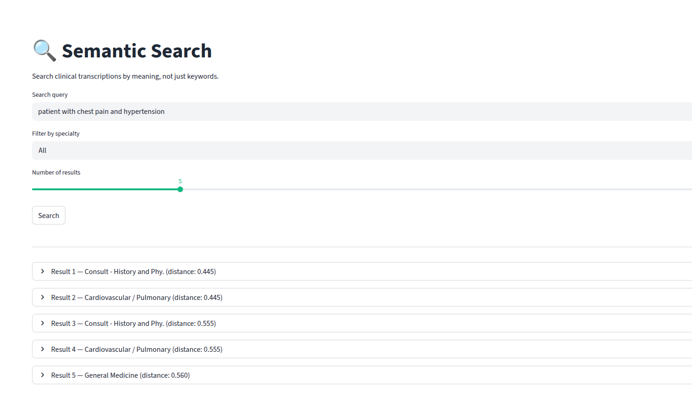
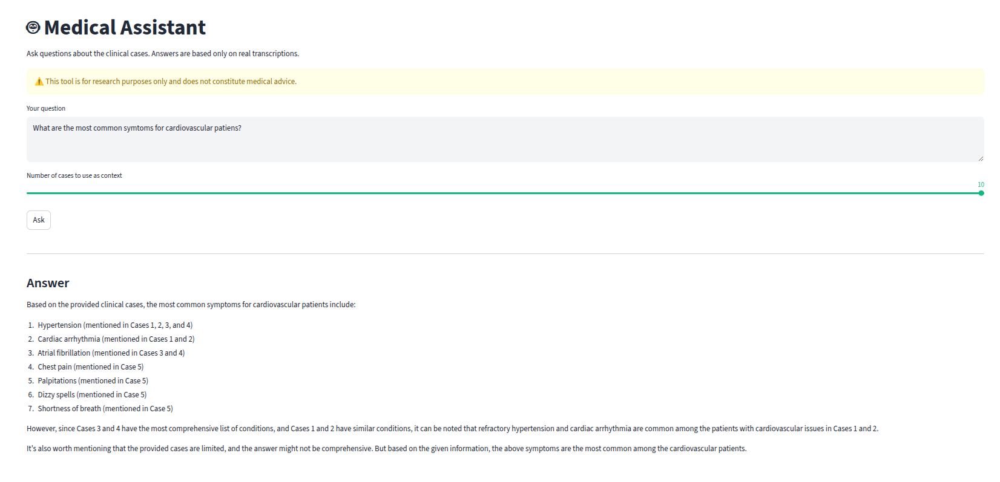
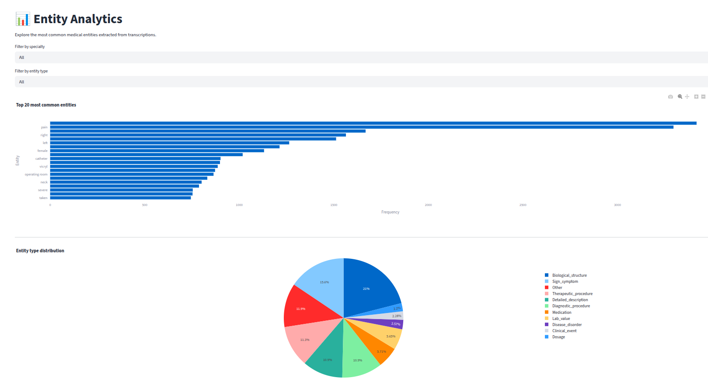

# 🏥 Anamnesis

> Clinical transcription analytics platform powered by NLP, semantic search and RAG.



## 🚀 Live Demo

[anamnesis.streamlit.app](https://anamnesis.streamlit.app) <!-- reemplazá con tu URL -->

---

## What it does

Anamnesis processes real clinical transcriptions and lets you:

- **Search semantically** — find cases by meaning, not just keywords
- **Ask the assistant** — get answers grounded in real clinical cases via RAG
- **Explore entities** — visualize the most common diseases, medications and symptoms
- **Filter by specialty** — Surgery, Cardiology, Neurology and 37 more

---

## Screenshots

| Home                     | Search                       |
| ------------------------ | ---------------------------- |
|  |  |

| Ask Assistant          | Analytics                          |
| ---------------------- | ---------------------------------- |
|  |  |

---

## Architecture

```
User
 ↓
Streamlit Dashboard
 ↓              ↓
ChromaDB      Groq LLM
(semantic     (RAG answers)
 search)
 ↑
Processed Dataset
(4966 transcriptions + NER entities)
```

## Tech Stack

| Layer      | Technology                                                                                                 |
| ---------- | ---------------------------------------------------------------------------------------------------------- |
| Dashboard  | Streamlit                                                                                                  |
| NLP / NER  | HuggingFace Transformers (`d4data/biomedical-ner-all`)                                                     |
| Embeddings | Sentence Transformers (`all-MiniLM-L6-v2`)                                                                 |
| Vector DB  | ChromaDB                                                                                                   |
| LLM        | Groq (`llama-3.3-70b-versatile`)                                                                           |
| Data       | [MTSamples](https://www.kaggle.com/datasets/tboyle10/medicaltranscriptions) — 4966 clinical transcriptions |

## Project Structure

```
anamnesis/
├── src/
│   ├── exploration.py   # EDA
│   ├── clean.py         # Data cleaning
│   ├── ner.py           # Named Entity Recognition pipeline
│   ├── embeddings.py    # ChromaDB vector index
│   └── rag.py           # RAG pipeline with Groq
├── dashboard/
│   ├── app.py           # Streamlit entry point
│   ├── custom.py        # Shared styles
│   └── pages/
│       ├── home.py
│       ├── search.py
│       ├── ask.py
│       └── analytics.py
├── data/
│   └── processed.csv    # 4966 transcriptions + NER entities
└── .streamlit/
    └── config.toml
```

## Installation

```bash
git clone https://github.com/tu-usuario/anamnesis
cd anamnesis
pip install -r requirements.txt
```

**Environment variables** (`.env`):

```
HF_TOKEN=your_huggingface_token
GROQ_API_KEY=your_groq_api_key
```

**Run:**

```bash
streamlit run dashboard/app.py
```

> **Note**: The first run downloads the NER model (~270MB) and builds the ChromaDB index.
> This takes ~10 minutes. Subsequent runs load from cache instantly.

## Dataset

[MTSamples](https://www.kaggle.com/datasets/tboyle10/medicaltranscriptions) — 4966 real medical transcriptions
across 40 specialties. NER was applied offline to extract biomedical entities
(diseases, medications, symptoms, procedures) using `d4data/biomedical-ner-all`.

## Disclaimer

This project is for **educational and research purposes only**.
It does not constitute medical advice. Always consult a qualified
healthcare professional for medical decisions.
